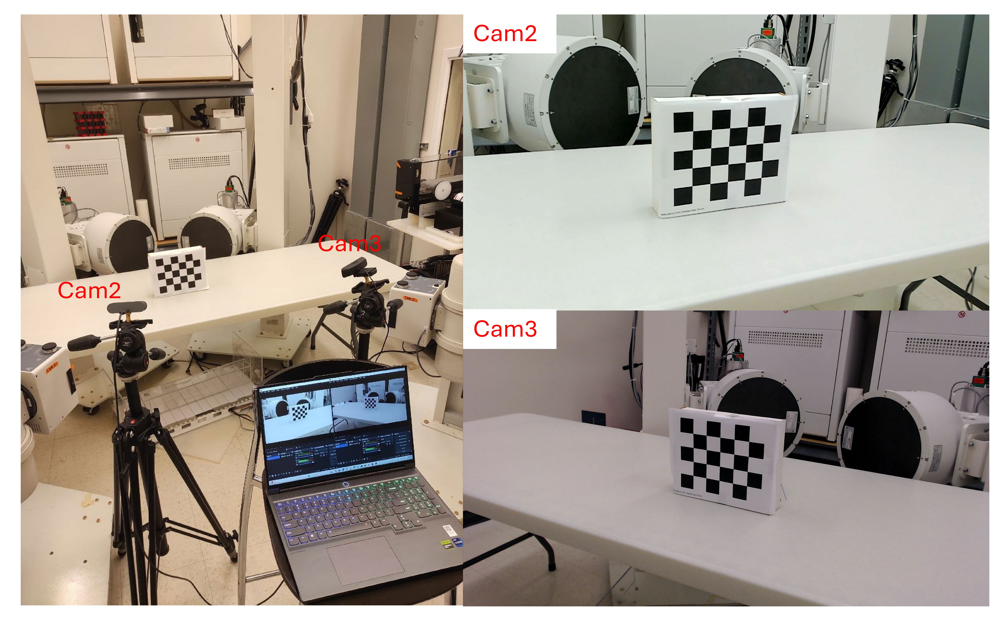
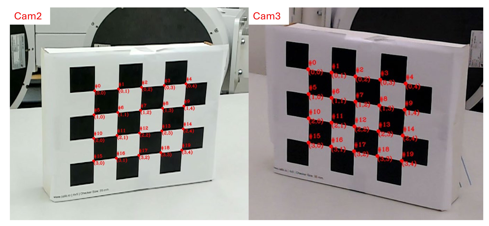
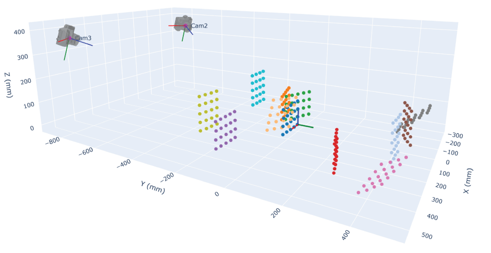
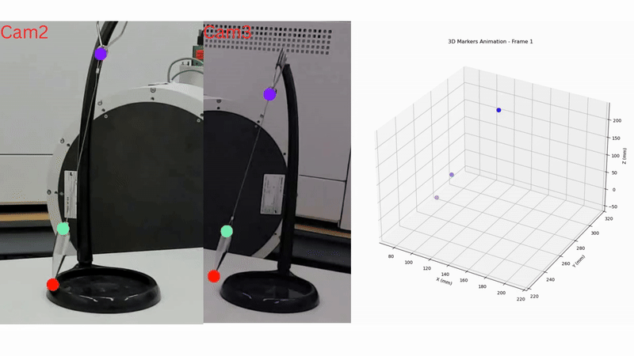

**Multi-Camera Calibration and 3D Reconstruction with Chessboard**

This repository contains a collection of Python scripts and a
step-by-step workflow for **multi-camera calibration** and **3D
reconstruction** using a standard chessboard pattern. It is designed for
simple webcam setups (e.g., Logitech cameras) but can be adapted to
other camera types. The process estimates each camera's intrinsic
parameters, extrinsic transformations, and finally uses triangulation to
recover 3D coordinates of object points observed by two or more cameras.

  

<b>Figure 1.</b> Camera setup and calibration images

------------------------------------------------------------------------

**Overview of the Scripts**

1.  **E1_automaticCornerSelection.py**

    -   **Purpose**:

        -   Automatically detect chessboard corners from user-selected
            Regions of Interest (ROIs) in your chessboard images.

        -   Saves the detected corners in .npz and .csv files.

    -   **Key Steps**:

        1.  It prompts you for a folder containing calibration images,
            which must be named with a **CamX_calpicYY.jpg** pattern.
            For example: **Cam1_calpic01.jpg**, and
            **Cam2_calpic02.jpg**. Here, \"CamX\" indicates the camera
            number (e.g., Cam1, Cam2), and \"calpicYY\" indicates the
            calibration image index (e.g., calpic01, calpic02).

        2.  You select an ROI on each image to help the script find the
            chessboard corners.

        3.  Corners are refined and saved if accepted.

2.  **E2_estimateCameraParameters.py**

    -   **Purpose**:

        -   Takes the detected corners from E1 and performs camera
            calibration (intrinsic + extrinsic) for each camera.

        -   Visualizes cameras and chessboard corners in 3D with Plotly,
            loading an STL camera model.

    -   **Key Steps**:

        1.  Loads corners from the .npz file produced in E1.

        2.  Calibrates each camera's intrinsics with OpenCV's
            calibrateCamera().

        3.  Solves for extrinsic poses (global→camera).

        4.  Exports final system parameters to .npz and .csv.

        5.  Creates a 3D interactive HTML visualization showing cameras
            and boards in the chosen coordinate system.

  

<b>Figure 2.</b> Chessboard corners detected with OpenCV’s findChessboardCorners() function

  

  <b>Figure 3.</b> 3D positions and orientations of the cameras and chessboard in the chosen coordinate system.
  (<a href="https://github.com/smarahmati/3D-Reconstruction-by-MultiCameraCalibration/tree/master/results/Calibration3DVis_withChessAndSTL.html">
    This figure was created with Plotly as an HTML file; please download it and open in a web browser to view the interactive visualization.
  </a>)

3.  **F_create_dlc_project.py**

    -   **Purpose**:

        -   Demonstrates how to create a DeepLabCut (DLC) project from a
            video or a set of images.

        -   If your pipeline includes tracking markers with DLC, you can
            use this script to automate the DLC project creation and
            frame extraction.

    -   **Key Steps**:

        1.  Creates a new DLC project.

        2.  Either extracts frames from a real video (uniform or k-means
            sampling) or copies existing images.

        3.  Updates the DLC config's body parts.

4.  **G_multi_cam_dlc_3d_reconstruction.py**

    -   **Purpose**:

        -   If you have 2D keypoints from DLC across multiple cameras,
            this script triangulates them into 3D given the known
            calibration.

    -   **Key Steps**:

        1.  Loads SystemParameters.npz (intrinsics/extrinsics).

        2.  Parses the DLC CSV files for each camera, merges them into a
            single 2D CSV.

        3.  Triangulates points by pairs of cameras to produce a 3D CSV
            of markers.

5.  **H_animation.py**

    -   **Purpose**:

        -   Reads the output 3D CSV from script G and creates a 3D
            animated scatter plot (using Matplotlib) to visualize marker
            trajectories over time.

    -   **Key Steps**:

        1.  Loads All3DMarkers.csv.

        2.  Plots the 3D points in each frame.

        3.  Generates a .mp4 animation (requires
            [FFmpeg](https://ffmpeg.org/)).

  

<b>Figure 4.</b> Pendulum videos tracked with DLC, and a 3D animation of the tracked points using camera calibrations

------------------------------------------------------------------------

**Requirements**

-   **Python 3.x** (tested with 3.9+ recommended)

-   **OpenCV** (opencv-python)

-   **NumPy**, **Matplotlib**, **Plotly** (for E2's 3D visualization)

-   **CSV / CSV Reader** (built-in Python)

-   **DeepLabCut** (for script F)

-   **py-stl** (numpy-stl) for loading STL camera models in E2

-   **FFmpeg** installed and accessible in your system PATH (for the
    H_animation script)

**Data and Outputs**

-   **acceptedDetections_20Corners.npz** / **.csv**\
    Chessboard corner detections from script E1.

-   **SystemParameters.npz** / **.csv**\
    Intrinsic + extrinsic parameters for each camera from script E2.

-   **All2D_data.csv** / **All3DMarkers.csv**\
    Merged 2D data and final triangulated 3D data from script G.

-   **MarkersAnimation.mp4**\
    3D animation of markers over time from script H.

------------------------------------------------------------------------

**Tips & Notes**

-   Make sure your chessboard has a known square size (in mm). Update
    that in E2_estimateCameraParameters.py (SQUARE_SIZE_MM).

-   The default pattern is (5,4) corners. Update it if your chessboard
    differs.

-   The camera coordinate system is defined by your chosen reference
    board pose and corner indices (origin corner, x-axis pair, z-axis
    pair). Please see E2_estimateCameraParameters.py.

-   For the animation script, be sure to have **FFmpeg** installed and
    properly referenced by Matplotlib.

------------------------------------------------------------------------

**Contact**

For questions or comments, please reach out to:

-   **Seyed Mohammadali Rahmati**: smarahmati@gmail.com
